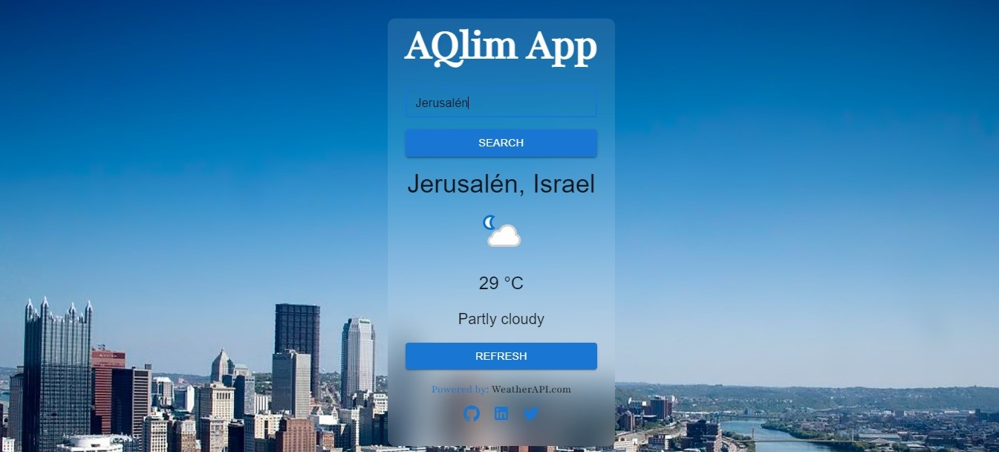

# React + Vite

This template provides a minimal setup to get React working in Vite with HMR and some ESLint rules.

Currently, two official plugins are available:

- [@vitejs/plugin-react](https://github.com/vitejs/vite-plugin-react/blob/main/packages/plugin-react/README.md) uses [Babel](https://babeljs.io/) for Fast Refresh
- [@vitejs/plugin-react-swc](https://github.com/vitejs/vite-plugin-react-swc) uses [SWC](https://swc.rs/) for Fast Refresh


# Proyecto de Aplicación de Clima

Este es un proyecto de una aplicación de clima que te permite buscar y mostrar información meteorológica en tiempo real para diferentes ciudades del mundo. La aplicación utiliza la API de WeatherAPI para obtener datos meteorológicos precisos y actuales.

## Tecnologías Utilizadas

- **Frontend**: React.js
- **Estilización**: Material-UI
- **Backend**: Node.js con Express.js
- **Base de Datos**: No se utiliza en este proyecto
- **API Externa**: WeatherAPI

## Funcionalidades

- Buscar y mostrar información de clima actual para una ciudad específica.
- Mostrar iconos de condiciones climáticas correspondientes.
- Manejo de errores y mensajes claros en caso de problemas.

## Instrucciones de Uso

1. Clona este repositorio en tu máquina local.
2. Abre una terminal en la carpeta del proyecto y ejecuta `npm install` para instalar las dependencias.
3. Crea un archivo `.env.local` en la raíz del proyecto y agrega tu clave de API de WeatherAPI:

   ```bash
   REACT_APP_API_KEY=YOUR_API_KEY
   ```

4. Ejecuta `npm run dev` para iniciar la aplicación en modo de desarrollo.

## Capturas de Pantalla

   

   


## Contacto

Si tienes alguna pregunta o comentario, no dudes en ponerte en contacto con el equipo de desarrollo en [programador5781](mailto:programador5781@gmail.com).


### Apoyame con un café
[](https://www.buymeacoffee.com/programador5781)

---


